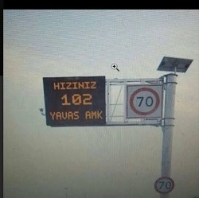

# Gulyabani's Speed Notify

### [TR]
Fivem için hız uyarı scripti.
Test amaçlı Salton City tarafındaki Havalimanına test amançlı bir tane blip ekledim, config.lua üzerinden daha fazla lokasyon ekleyip ayarlamaları yapabilirsiniz.

Ek Bilgiler:
- Car, Bike, Quadbike ve Amfibi versiyonlarının kontrolleri yapılmaktadır. Uçaklar, helikopterler vb. dahil değildir.
- Thruster uçak olarak geçmediği için o da hız kontrolüne takılmaktadır.
- Herhangi bir framework e bağlı olmadığı için PED JOB kontrolü yapılmamaktadır. Gerektiği takdirde eklenebilir.
- Custom araçlar ile test edilmemiştir. Eğer araç verisinin metadatası doğru formatta ise yüksek ihtimalle sorun olmadan çalışacaktır.
- KM/H formatında çalışmaktadır.

### [EN]
Fivem script for speed limit notification.
I added a blip for testing purposes at the airport near Salton City. You can add more locations and configure settings on config.lua.

Additional Information:
- Controls are for the Car, Bike, Quadbike, and Amphibious versions. Aircraft, helicopters, etc., are not included.
- Thruster is subject to speed control as it is not classified as an aircraft.
- This script is not dependent on any framework, PED JOB control is not conducted. It can be added if necessary.
- Custom vehicles have not been tested. If the metadata of the vehicle data is in the correct format, it will likely work without any issues.
- Using KM/H format

Version Histor:
- 0.1a initial release
- 0.2a add more config option and detection radius 100 -> 150

tag: 
fivem speedcam
fivem speed detect
fivem speed notify